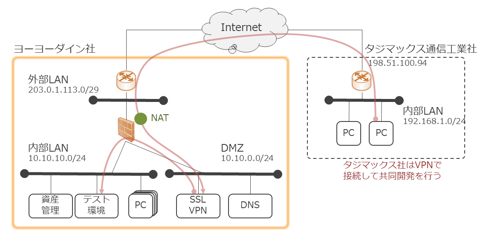
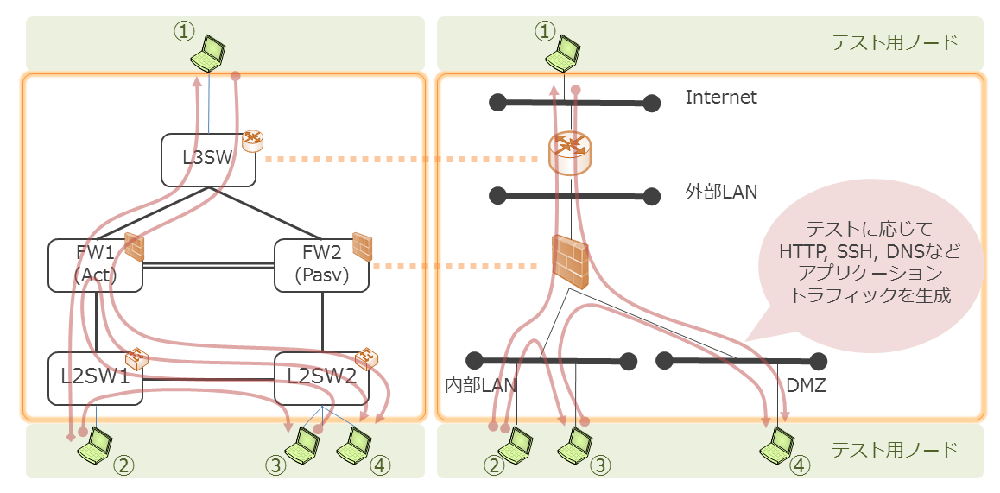
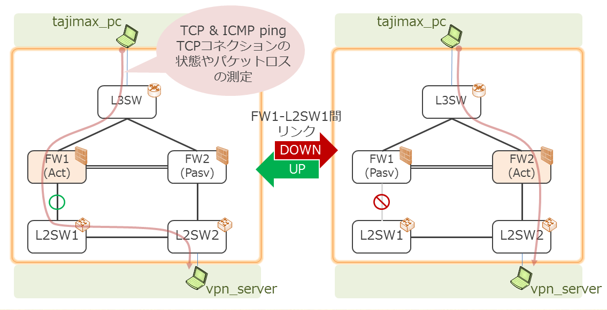

# NetTester examples

## テスト対象のネットワーク
タジマックス通信工業社 (長いので以降 "タジマックス社") は、
ヨーヨーダイン社と共同でソフトウェア開発を行っており、
タジマックス社からVPNでヨーヨーダイン社内の開発環境へアクセスします。

今回、ヨーヨーダイン社のネットワークを新規に構築し直すことになりました。
ヨーヨーダイン社のネットワークの構築もタジマックス社が請け負います。
タジマックス社は以下の図のようなネットワークを構築することにしました。

ネットワークの構築にあたり、ヨーヨーダイン社の要件（ネットワーク上で行いたい業務）をもとに、
構築したネットワーク上で求められた業務ができるかどうかをテストします。
テスト対象はヨーヨーダイン社のネットワークです。

## テスト

### 静的なテスト
このプロジェクトでは、ネットワークが一定の状態にある(ネットワークの状態が変化しない)ときに、
end-to-end の通信ができるかどうかをテストすることを「静的なテスト」と呼んでいます。

今回、ヨーヨーダイン社のネットワークでは、
以下のように、セグメント内・セグメント間をつなぐ、様々なアプリケーション通信が発生します。

これらのアプリケーション通信（アプリケーションを使う業務）が構築したネットワークで
問題なくおこなえるかどうかをテストします。

静的なテストの例:
* [NTP で時刻を同期](https://github.com/net-tester/examples/blob/develop/features/ntp.feature)
* [社内 Git サービス](https://github.com/net-tester/examples/blob/develop/features/git.feature)
* [Google 検索](https://github.com/net-tester/examples/blob/develop/features/google.feature)
* [社内 DNS サーバで名前解決](https://github.com/net-tester/examples/blob/develop/features/dns_dmz_from_internal_network.feature)
* [上位 DNS サーバで名前解決](https://github.com/net-tester/examples/blob/develop/features/dns_internet_from_dmz.feature)
* [pingで社内からDMZ内のDNSサーバへ疎通確認](https://github.com/net-tester/examples/blob/develop/features/ping_dmz_dns_from_internal_network.feature)
* [pingで社内からDMZへ疎通確認](https://github.com/net-tester/examples/blob/develop/features/ping_dmz_from_internal_network.feature)
* [pingでDMZから社内へ疎通確認](https://github.com/net-tester/examples/blob/develop/features/ping_internal_network_from_dmz.feature)
* [sshで社内から資産管理サーバへログイン](https://github.com/net-tester/examples/blob/develop/features/ssh_asset_management_server_from_internal_network.feature)
* [sshで社内からテスト環境サーバへログイン](https://github.com/net-tester/examples/blob/develop/features/ssh_test_environment_server_from_internal_network.feature)
* [pingでインターネットからルータへの疎通確認](https://github.com/net-tester/examples/blob/develop/features/ping_router_from_internet.feature)
* [pingでインターネットからファイアウォールへの疎通確認](https://github.com/net-tester/examples/blob/develop/features/ping_firewall_from_internet.feature)
* [telnetで社内からテスト環境サーバへログイン](https://github.com/net-tester/examples/blob/develop/features/telnet_internal_network.feature)

### 動的なテスト
このプロジェクトでは、ネットワークの状態が変化するとき
(トポロジが変わる、Active/Standbyが変化して通信経路が変わる、など) に
end-to-end の通信にどのような影響があるか・コネクションが維持されるかどうかをテストすることを、
「動的なテスト」と呼んでいます。

ヨーヨーダイン社のネットワークでは、社内の Firewall として、
Active/Passive(standby)で HA (High Availability) 構成をとれる機材を使うことにしました。

通常、FW1 が Active となるようにしていますが、
FW1 にリンク障害が発生して Active/Passive が交代するときに、
FW を経由する通信を伴う業務が継続可能かどうかテストします。

動的なテストの例:
* [内部ネットワーク向けリンク障害と回復時におけるpingの通信継続確認](https://github.com/net-tester/examples/blob/develop/features/icmp_fw1_l2sw1_linkdown.feature)
* [外部ネットワーク向けリンク障害と回復時におけるpingの通信継続確認](https://github.com/net-tester/examples/blob/develop/features/icmp_fw1_l2swex_linkdown.feature)
* [外部ネットワーク向けリンク障害と回復時におけるTCPの接続維持確認](https://github.com/net-tester/examples/blob/develop/features/tcp_fw1_l2sw1_linkdown.feature)
* [リモートワーク作業中のリンク障害、回復における接続維持確認](https://github.com/net-tester/examples/blob/feature/develop/features/remotework_linkdown.feature)

## 実際のテストの様子
実際にテストを実行している様子を、以下のリンク先から見ることができます。

### 解説付きデモ動画

静的なテスト・動的なテストの連続実行、要求変更に対するヨーヨーダイン社ネットワークの設定変更+テストの再実行（回帰テスト）、という一連の作業プロセスを実行しています。

### Screen Cast
[Asciinema](https://asciinema.org/) によるテスト実行の様子の録画です。
* [デモ動画(リアルタイム・解説なし)](https://asciinema.org/a/c9n8xrwxfofpoxvb306ucmb94)
: Youtube の解説付きデモ動画の元素材です。
解説付きデモ動画では terminal の様子は早送りした状態になっていますが、こちらはリアルタイム + 編集なしです。
* [静的なテスト実行部分の抜粋](https://asciinema.org/a/8wyyvxyxkxv37snfucqw84ngr)
: 静的なテストの連続実行の様子です。
